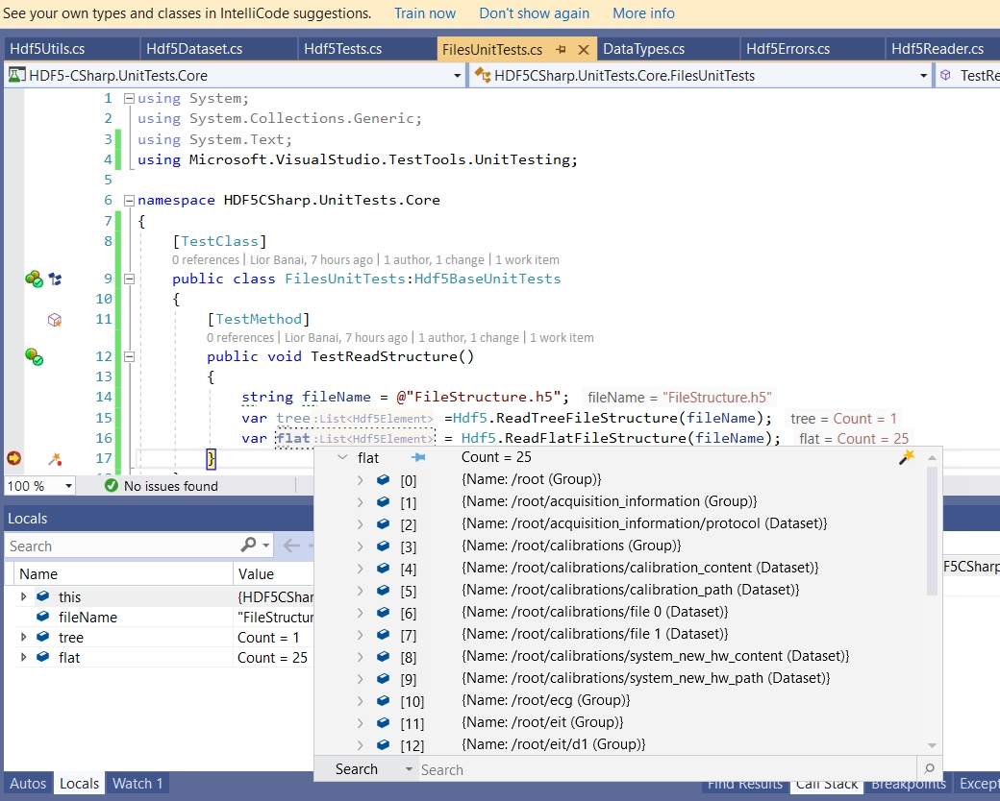

<h1 align="center">HDF5-CSharp: C# wrapper for HDF5 library </h1> 

[](https://gitter.im/HDF5-CSharp/community?utm_source=badge&utm_medium=badge&utm_campaign=pr-badge&utm_content=badge)  [](https://liorbanai.visualstudio.com/HDF5-CSharp/_build/latest?definitionId=3&branchName=master) 
[](https://dependabot.com)
<a href="https://github.com/LiorBanai/HDF5-CSharp/issues">
    
</a> 
<a href="https://github.com/LiorBanai/HDF5-CSharp/blob/master/LICENSE">
    
</a>
<a href="https://scan.coverity.com/projects/liorbanai-hdf5dotnetwrapper"> 
</a>

[](https://www.nuget.org/packages/HDF5-CSharp/)
<a href="https://github.com/LiorBanai/HDF5-CSharp/releases"> 
    
</a>
 <a href="https://github.com/LiorBanai/HDF5-CSharp/compare/V1.11.0...master">
    
</a>
[](https://www.nuget.org/packages/HDF5-CSharp/)


Hdf5 Wrapper: Set of tools that help in reading and writing hdf5 files for .net environments

## Usage

### write an object to an HDF5 file
In the example below an object is created with some arrays and other variables
The object is written to a file and than read back in a new object.


```csharp

     private class TestClassWithArray
        {
            public double[] TestDoubles { get; set; }
            public string[] TestStrings { get; set; }
            public int TestInteger { get; set; }
            public double TestDouble { get; set; }
            public bool TestBoolean { get; set; }
            public string TestString { get; set; }
        }
     var testClass = new TestClassWithArray() {
                    TestInteger = 2,
                    TestDouble = 1.1,
                    TestBoolean = true,
                    TestString = "test string",
                    TestDoubles = new double[] { 1.1, 1.2, -1.1, -1.2 },
                    TestStrings = new string[] { "one", "two", "three", "four" }
        };
    int fileId = Hdf5.CreateFile("testFile.H5");

    Hdf5.WriteObject(fileId, testClass, "testObject");

    TestClassWithArray readObject = new TestClassWithArray();

    readObject = Hdf5.ReadObject(fileId, readObject, "testObject");

    Hdf5.CloseFile(fileId);

```


## Write a dataset and append new data to it

```csharp

    /// <summary>
    /// create a matrix and fill it with numbers
    /// </summary>
    /// <param name="offset"></param>
    /// <returns>the matrix </returns>
    private static double[,]createDataset(int offset = 0)
    {
      var dset = new double[10, 5];
      for (var i = 0; i < 10; i++)
        for (var j = 0; j < 5; j++)
        {
          double x = i + j * 5 + offset;
          dset[i, j] = (j == 0) ? x : x / 10;
        }
      return dset;
    }

    // create a list of matrices
    dsets = new List<double[,]> {
                createDataset(),
                createDataset(10),
                createDataset(20) };

    string filename = Path.Combine(folder, "testChunks.H5");
    int fileId = Hdf5.CreateFile(filename);    

    // create a dataset and append two more datasets to it
    using (var chunkedDset = new ChunkedDataset<double>("/test", fileId, dsets.First()))
    {
      foreach (var ds in dsets.Skip(1))
        chunkedDset.AppendDataset(ds);
    }

    // read rows 9 to 22 of the dataset
    ulong begIndex = 8;
    ulong endIndex = 21;
    var dset = Hdf5.ReadDataset<double>(fileId, "/test", begIndex, endIndex);
    Hdf5.CloseFile(fileId);

```

for more example see unit test project

## Reading H5 File:
you can use the following two method to read the structure of an existing file:

```csharp

string fileName = @"FileStructure.h5";
var tree =Hdf5.ReadTreeFileStructure(fileName);
var flat = Hdf5.ReadFlatFileStructure(fileName);
```

in tree-like format you can drill inside the hierarchy of the file wile the flat option shows all the name is the groups and datasets.



## Additional settings
 - Hdf5EntryNameAttribute: control the name of the field/property in the h5 file:
 
 ```csharp
     [AttributeUsage(AttributeTargets.All, AllowMultiple = true)]
    public sealed class Hdf5EntryNameAttribute : Attribute
    {
        public string Name { get; }
        public Hdf5EntryNameAttribute(string name)
        {
            Name = name;
        }
    }
```

example:  
```csharp
private class TestClass : IEquatable<TestClass>
        {
            public int TestInteger { get; set; }
            public double TestDouble { get; set; }
            public bool TestBoolean { get; set; }
            public string TestString { get; set; }
            [Hdf5EntryNameAttribute("Test_time")]
            public DateTime TestTime { get; set; }
        }
```

 - Time and fields names in H5 file:
 
 ```csharp
     public class Settings
    {
        public DateTimeType DateTimeType { get; set; }
        public bool LowerCaseNaming { get; set; }
    }

    public enum DateTimeType
    {
        Ticks,
        UnixTimeSeconds,
        UnixTimeMilliseconds
    }
    
```

usage:
 ```csharp
        [ClassInitialize()]
        public static void ClassInitialize(TestContext context)
        {
            Hdf5.Hdf5Settings.LowerCaseNaming = true;
            Hdf5.Hdf5Settings.DateTimeType = DateTimeType.UnixTimeMilliseconds;
        }
            
```

 - Logging: use can set logging callback via: Hdf5Utils.LogError, Hdf5Utils.LogInfo, etc
 
 ```csharp
public static class Hdf5Utils
    {
        public static Action<string> LogError;
        public static Action<string> LogInfo;
        public static Action<string> LogDebug;
        public static Action<string> LogCritical;
    }
 ```


in order to log errors use this code snippet:
```csharp
            Hdf5.Hdf5Settings.EnableErrorReporting(true);
            Hdf5Utils.LogWarning = (string s) => {...}
            Hdf5Utils.LogCritical = (string s) => {...}
            Hdf5Utils.LogError = (string s) => {...}
```


